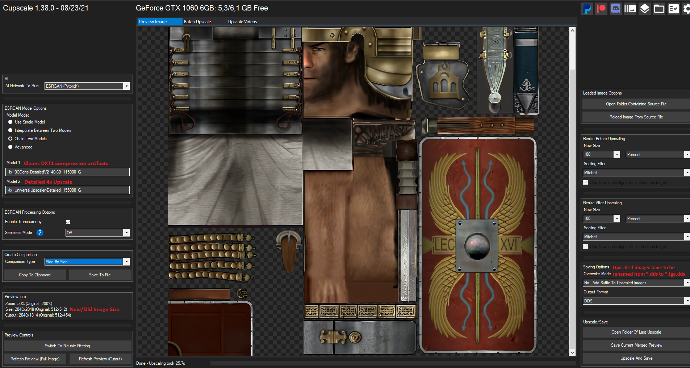
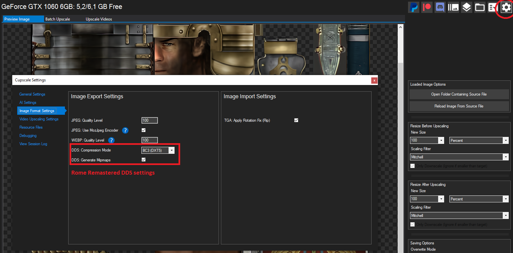
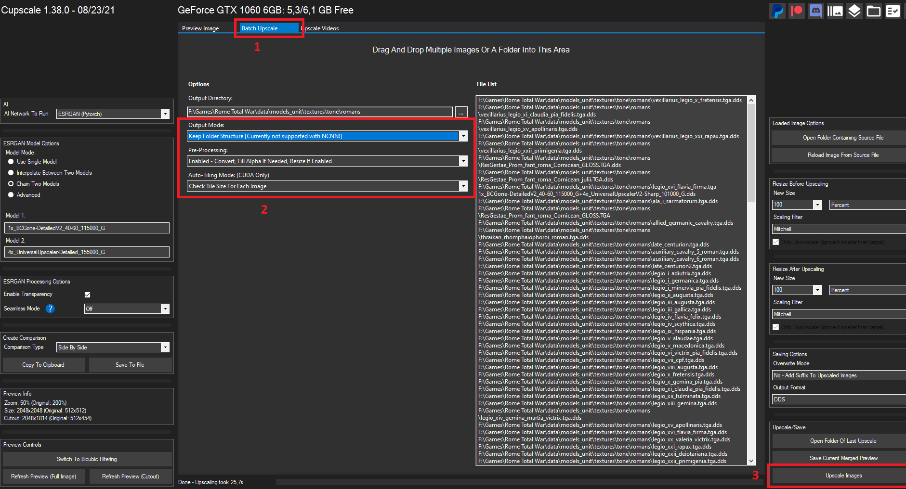

# Upscaling Rome Total War textures to Total War: ROME REMASTERED

## Table Of Contents

* [Summary](#summary)
* [Acknowledgements &amp; Thanks](#acknowledgements--thanks)

## Introduction

When importing and updating assets from the original Rome you might want to use AI upscaling to improve the quality before using them in the Remaster.

The art of upscaling textures using AI is a rapidly evolving field so this page is meant to a quick primer on the basics. Once you have a firm grasp of the basics there are many potential avenues to explore based on the type of textures you're aiming to upscale and how you intend for them to be used in the final game.

## Summary

In summary, you’ll need to:

* Install Cupscale (MIT license) https://github.com/n00mkrad/cupscale
* Follow the guides to get it working and pick an AI model for the upscaling (this guide assumes ESRGAN - Pytorch)
* Get all your textures ready for upscaling

## Upscale Settings

Below are some images and settings used to upscale textures for Rome Remastered. These settings are based on the settings used by the Chivalry and RIS mods to upscale the units that they used in their mods.

1. Set your AI network to ESRGAN (Pytorch)
2. Then you can set the following options:
   * Chain Two Models
   * `1x_BCGone-DetailedV2_40-60_115000_G` (Cleans DXT1 compression artefacts)
   * `4xUniversalUpscaler-Detailed_155000_G` (Detailed 4x Upscale)
3. Check preview image and preview info
4. Set saving options
   * Override mode `No - Add Suffix`
   * Output format `DDS` 
	
	
	
5. Click on the cog in the top right	
6. Image Export Settings
	a. DDS: Compression Mode `BC3 (DXT5)`
	b. Generate Mipmaps `[x]`

7. Select Batch Tab
   * Output Mode: `Keep Folder Structure`
   * Pre-Processing: `Enabled - Convert, Fill Alpha if Needed, Resize if enabled`
   * Auto-Tiling Mode: `Check title size for each image`
8. Press `Upscale Image` (and go an make a coffee)
	
Once they are complete you can return to the main Importing RTW units guide for how to link them to the correct model files in the Remaster.

## Acknowledgements & Thanks

This guide was created with the assistance of Swagger & Starkgate from the RIS modding team. He has used this tool to upscale many textures that are used in the RIS and Chivary mods for Rome Remastered. We have used their settings and experiences as a basis for this guide.

